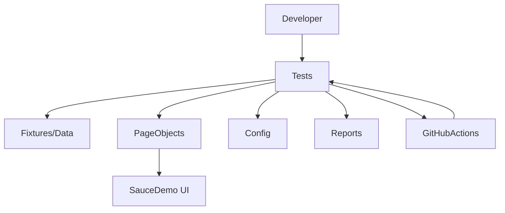

Status Badge: 
[](https://github.com/asifmahbubnaeem/ecommerce-automation-test-playwright-pytest/actions/workflows/ci.yml)


## Overview

This repository contains a production-grade UI test automation framework for the SauceDemo e-commerce site, implemented in **Python + Playwright** with **pytest** as the test runner.

The focus is on clean architecture, maintainability, and realistic engineering practices: configuration and test data management, Page Object Model, fixtures, reporting, and CI/CD via GitHub Actions.

## Framework Choice & Rationale

- **Python + Playwright + pytest**:
  - Playwright provides fast, reliable, auto-waiting browser automation with rich debugging (traces, screenshots, videos).
  - Python and pytest are widely adopted in QA teams, with excellent plugin ecosystems and simple, expressive test syntax.
  - The stack is well-suited for parallel execution and CI environments.
- **Alternatives considered**:
  - **Selenium**: very mature and flexible, but more verbose and requires more manual wait handling.
  - **Cypress**: great Developer Experience for JS ecosystems, but focused on Chrome-family browsers and JavaScript; less aligned with a Python-centric QA stack.

Considering robust architecture, flakiness handling,  CI integration : Python + Playwright + pytest strikes the best balance between reliability, speed, and readability.

## Architecture Overview

High-level structure:

- **Config layer**: `tests/config/` – YAML-based environment configuration (`base.yml`, `ci.yml`) with a typed `AppConfig` model and loader.
- **Data layer**: `tests/fixtures/` – JSON test data (`users.json`, `invalid_logins.json`) and helpers/factories for checkout data.
- **Page Objects**: `tests/pages/` – page classes modelling key areas of SauceDemo (login, inventory, cart, checkout steps, confirmation).
- **Utilities**: `tests/utils/` – reusable assertions, waits, and visual comparison helpers.
- **Tests**: `tests/test_suites/` – feature-based test modules for authentication, catalog, cart, checkout, and resilience.
- **Reporting**: `reports/` – HTML report and Allure results (gitignored) produced by pytest and used in CI artifacts.

Logical flow:



## Repository Layout

- `.github/workflows/ci.yml` – GitHub Actions workflow that installs dependencies, runs tests, and uploads reports.
- `tests/`
  - `config/`
    - `models.py` – `AppConfig` Pydantic model.
    - `loader.py` – environment-aware config loader using YAML files and `.env`.
    - `base.yml`, `ci.yml` – default and CI overrides.
  - `fixtures/`
    - `users.json` – SauceDemo user types and expected behaviour metadata.
    - `invalid_logins.json` – negative login scenarios (empty fields, wrong password, SQL injection style input).
    - `data_loader.py` – JSON access helpers (`get_user`, `get_invalid_login_scenarios`).
    - `factories.py` – random checkout user data factory.
  - `pages/`
    - `base_page.py` – shared navigation, waits, screenshots, and config access.
    - `login_page.py`, `inventory_page.py`, `cart_page.py`, `checkout_step_one_page.py`,
      `checkout_step_two_page.py`, `checkout_complete_page.py`.
  - `utils/`
    - `waits.py` – network idle wait helper.
    - `assertions.py` – domain-specific assertions (sorting, cart badge, order totals).
    - `visual.py` – helper for image `src` comparison.
  - `test_suites/`
    - `test_auth.py` – authentication and session tests.
    - `test_catalog.py` – product listing, sorting, and `problem_user` image checks.
    - `test_cart.py` – cart badge, add/remove, persistence tests.
    - `test_checkout.py` – end-to-end checkout, validations, and order summary checks.
    - `test_resilience.py` – performance and error user behaviour tests.
- `reports/` – generated reports directory (ignored by git).
- `.env.example` – example environment file.
- `pyproject.toml` – dependencies, pytest configuration, and dev tooling.

## Setup & Run Instructions

### Prerequisites

- Python 3.11+
- `pip` and the `playwright` CLI (installed as part of dependencies)
- Git

### Local setup [ubuntu]

```bash
git clone https://github.com/asifmahbubnaeem/ecommerce-automation-test-playwright-pytest.git or git@github.com:asifmahbubnaeem/ecommerce-automation-test-playwright-pytest.git
cd ecommerce-automation-test-playwright-pytest/

python3 -m venv .venv
source .venv/bin/activate  # Windows: .venv\Scripts\activate

pip install --upgrade pip
pip install .[dev]

# Install Playwright browsers
playwright install
```
in case of getting host system is missing dependencies error:
check if pip3 list | grep playwright or pip list | grep playwright to check if playwright is actually installed then run command

```playwright install-deps```

Create a local `.env` based on the example:

```bash
cp .env.example .env
```

### Local setup [windows]
```PowerShell
git clone https://github.com/asifmahbubnaeem/ecommerce-automation-test-playwright-pytest.git
cd ecommerce-automation-test-playwright-pytest/

create virtual environment:
python -m venv .venv

Set-ExecutionPolicy -ExecutionPolicy RemoteSigned -Scope CurrentUser
 .\.venv\Scripts\Activate.ps1


python.exe -m pip install --upgrade pip
playwright install

cp .env.example .env
```
Execute Tests:
```pytest```

We can adjust:

- `ENV` – environment profile (`dev` by default, `ci` in CI).
- `E2E_SITE` (or `SITE`) – select which ecommerce site config to run against (see `tests/config/sites.yml`).
- `BASE_URL` – override base URL if needed (takes precedence over the selected site’s `base_url`).
- `HEADLESS` – `true` or `false`.

### Running tests locally

From the project root:

```bash
pytest
```

This will:

- Run tests under `tests/`.
- Generate an HTML report in `reports/html/report.html`.
- Generate Allure results in `reports/allure-results/`.

We can also selectively run suites, for example:

```bash
pytest tests/test_suites/test_auth.py
pytest tests/test_suites/test_catalog.py -k sort
```

## Run locally to generate allure report
**Commands**
  - `pytest --alluredir=reports/allure`
  - `allure generate reports/allure -o reports/allure-report --clean`
  - `allure serve reports/allure     # optional: opens in browser`

## CI/CD Pipeline

CI is implemented using **GitHub Actions** in `.github/workflows/ci.yml`.

Pipeline behaviour:

- Triggers on `push` and `pull_request` to `main`.
- Set the ruleset for the default/main branch so that only users with 'Admin role' can direct push to main branch
- Uses `actions/setup-python` to provision Python 3.11.
- Installs project (and dev) dependencies and Playwright browsers.
- Runs `pytest` with:
  - HTML reporting configured via `pytest_configure` hook.
  - Allure results written to `reports/allure-results/`.
- Uploads:
  - `reports/html/` as artifact `html-report`.
  - `reports/allure-results/` as artifact `allure-results`.


## Test Coverage Summary

- **2.1 Authentication**
  - Successful login with valid credentials: `test_login_success_standard_user`.
  - Login failure with invalid credentials (wrong password, empty fields, SQL injection-like input): `test_login_failure_invalid_credentials` (data-driven from `invalid_logins.json`).
  - Locked-out user behaviour: `test_locked_out_user_behavior`.
  - Session persistence / logout behaviour: `test_logout_and_session_persistence`.
 

- **2.2 Product Catalog**
  - Product listing loads correctly (count, names, prices visible): `test_product_listing_loads_correctly`.
  - Sorting by Name A→Z, Name Z→A, Price Low→High, Price High→Low: sorting tests in `test_catalog.py`.
  - `problem_user` visual regression: `test_problem_user_image_mismatches` compares image `src` values between `standard_user` and `problem_user`.

- **2.3 Shopping Cart**
  - Add single item and verify cart badge updates: `test_add_single_item_updates_cart_badge`.
  - Add multiple items and verify all appear in cart: `test_add_multiple_items_appear_in_cart`.
  - Remove item and verify cart state: `test_remove_item_updates_cart`.
  - Cart persists across navigation: `test_cart_persists_across_navigation`.

- **2.4 Checkout Flow (End-to-End)**
  - Complete full purchase with valid details: `test_complete_purchase_with_valid_details`.
  - Checkout blocked when required fields missing: `test_checkout_blocked_when_required_fields_missing`.
  - Verify order summary math: `test_order_summary_totals_are_correct` validates consistency between item total, tax, and final total.
  - Verify confirmation screen: `test_confirmation_screen_content`.

- **2.5 Performance & Resilience**
  - `performance_glitch_user` login with smart waits: `test_performance_glitch_user_login_succeeds_with_smart_waits`.
  - `error_user` – error selecting and removing products & broken sort issues

### Intentional exclusions and extensions

- Deep visual regression (pixel-by-pixel) is intentionally out of scope; we focus on functional `src` checks for `problem_user`.
- Load testing and long-duration stability tests are not implemented here but can be layered on using the same page objects and fixtures.
- API-level tests are not included but the structure allows them to be added alongside UI tests.

## Quality Practices

- **Linting/formatting**: `ruff` and `black` are configured via `pyproject.toml` (install with `pip install .[dev]`).
- **Separation of concerns**: tests express business flows; page objects encapsulate UI details; config/data are externalised from tests.
- **Flakiness mitigation**:
  - Reliance on Playwright’s auto-wait capabilities.
  - Explicit waits only where needed.
  - No `time.sleep` used.
